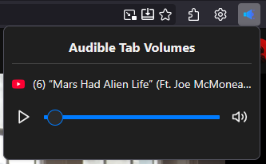

# Volume For Tabs

A simple browser extension that allows you to adjust the volume of each tab individually.



## Features

*   **Individual Tab Volume Control:** Adjust the volume of each browser tab independently.
*   **Mute and Unmute Tabs:** Quickly mute and unmute tabs with a single click.
*   **Visual Volume Level:** The extension icon provides a visual indication of the current tab's volume level.
*   **Persistent Volume Settings:** The volume level for each tab is saved and restored automatically.

## Installation

You can install the Volume For Tabs extension from the [Firefox Add-on Store](https://addons.mozilla.org/en-US/firefox/addon/volume-for-tabs/).

## How to Use

1.  Click on the extension icon in the toolbar to open the popup.
2.  Use the slider to adjust the volume for the current tab.
3.  The volume level is saved automatically for each tab.

## Contributing

Contributions are welcome! If you want to contribute to this project, please follow these steps:

1.  **Fork the repository.**
2.  **Clone your forked repository to your local machine.**
3.  **Install the dependencies.** This project uses `web-ext`, which can be installed via `npm`:
    ```bash
    npm install --global web-ext
    ```
4.  **Run the extension in development mode:**
    ```bash
    web-ext run
    ```
    This will launch a new Firefox instance with the extension installed.
5.  **Make your changes.**
6.  **Submit a pull request.**

## License

This project is licensed under the MIT License - see the [LICENSE](LICENSE) file for details.